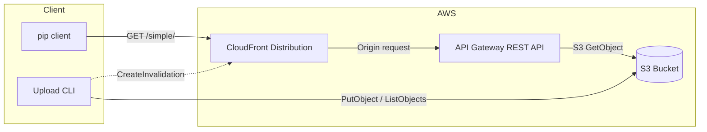

# Design Document

## Overview

This design describes a private PyPI server built on AWS using S3 for storage, API Gateway as the HTTP front-end, and CloudFront as a caching layer. The system implements the PEP 503 Simple Repository API so that standard `pip` clients can install packages without modification. A Python CLI tool handles uploading distribution files and regenerating the HTML index pages that make the repository browsable.

The architecture follows a serverless, read-heavy pattern: packages are stored as static objects in S3, API Gateway proxies read requests directly to S3 using AWS service integration (no Lambda), and CloudFront caches responses to minimize latency and API Gateway invocations. The CLI is the only write path — it uploads distribution files, regenerates index HTML, and optionally invalidates the CloudFront cache.

All infrastructure is defined in a single CloudFormation YAML template and deployed via the AWS CLI.



## Architecture

### Component Topology

The system has three AWS components and one local component:

1. **S3 Bucket** — Stores distribution files (`.whl`, `.tar.gz`) under `packages/{normalized_name}/{filename}` and HTML index pages at `simple/` (root index) and `simple/{normalized_name}/` (per-package index).

2. **API Gateway (REST API)** — Exposes three route patterns that proxy to S3 using AWS service integration:
   - `GET /simple/` → S3 `GetObject` for the root index page
   - `GET /simple/{package}/` → S3 `GetObject` for the package detail page
   - `GET /simple/{package}/{file}` → S3 `GetObject` for the distribution file

3. **CloudFront Distribution** — Sits in front of API Gateway, caches responses with a configurable TTL (default 300s), and provides TLS termination with the default `*.cloudfront.net` domain.

4. **Upload CLI** — A Python CLI that uploads distribution files to S3, regenerates PEP 503-compliant HTML index pages, and optionally creates CloudFront invalidations.

### Request Flow

**Package installation (read path):**
1. `pip install --index-url https://{cf-domain}/simple/ my-package`
2. CloudFront receives the request. On cache miss, it forwards to API Gateway.
3. API Gateway maps the request path to an S3 object key and calls `s3:GetObject`.
4. S3 returns the HTML index page or binary distribution file.
5. API Gateway returns the response with appropriate `Content-Type`.
6. CloudFront caches the response and returns it to the client.

**Package upload (write path):**
1. `s3pypi upload my_package-1.0.0-py3-none-any.whl --bucket my-bucket`
2. CLI validates the file exists and parses the package name from the filename.
3. CLI uploads the file to `packages/{normalized_name}/{filename}` in S3.
4. CLI lists all files under `packages/{normalized_name}/` and regenerates the package detail page at `simple/{normalized_name}/index.html`.
5. CLI lists all "directories" under `packages/` and regenerates the root index page at `simple/index.html`.
6. If `--cloudfront-distribution-id` is provided, CLI creates an invalidation for `/simple/` and `/simple/{normalized_name}/`.

### S3 Object Layout

```
bucket-root/
├── simple/
│   ├── index.html                          # Package_Index_Page (root)
│   └── {normalized-package-name}/
│       └── index.html                      # Package_Detail_Page
└── packages/
    └── {normalized-package-name}/
        ├── my_package-1.0.0-py3-none-any.whl
        └── my_package-1.0.0.tar.gz
```

### API Gateway Route Mapping

| API Gateway Path | S3 Object Key | Content-Type |
|---|---|---|
| `GET /simple/` | `simple/index.html` | `text/html` |
| `GET /simple/{package}/` | `simple/{package}/index.html` | `text/html` |
| `GET /simple/{package}/{file}` | `packages/{package}/{file}` | Binary passthrough |

The API Gateway uses AWS service integration (not Lambda proxy) to call S3 directly. Each method has:
- **Integration request**: Maps the URL path parameters to the S3 bucket and object key using request mapping templates.
- **Integration response**: Maps S3 responses to HTTP responses, including 404 handling for missing objects.
- **IAM role**: A dedicated role granting `s3:GetObject` on the bucket.

### CloudFront Configuration

- **Origin**: API Gateway invoke URL (regional endpoint)
- **Origin Protocol Policy**: HTTPS only
- **Cache Policy**: Default TTL 300s (configurable via CloudFormation parameter)
- **Viewer Protocol Policy**: Redirect HTTP to HTTPS
- **Minimum TLS Version**: TLSv1.2
- **Forwarded Headers**: `Host` header forwarded to origin for API Gateway routing
- **Custom Domain (optional)**: When `DomainName` and `AcmCertificateArn` parameters are provided, the distribution is configured with the domain as a CNAME alias and the ACM certificate for TLS. Otherwise, the default `*.cloudfront.net` domain and certificate are used.

## Components and Interfaces

### CloudFormation Template (`template.yaml`)

**Parameters:**
- `StackNamePrefix` (String, default: `s3-pypi`) — Prefix for resource naming
- `CacheTTL` (Number, default: `300`) — CloudFront default cache TTL in seconds
- `DomainName` (String, default: `""`) — Optional custom domain name for CloudFront (e.g., `pypi.example.org`). Leave empty to use the default CloudFront domain.
- `AcmCertificateArn` (String, default: `""`) — Optional ACM certificate ARN for the custom domain. Required when `DomainName` is provided.

**Conditions:**
- `HasCustomDomain` — True when both `DomainName` and `AcmCertificateArn` are non-empty. Controls whether the CloudFront distribution uses a custom alias and ACM certificate or the default CloudFront domain.

**Resources:**
- `PyPIBucket` — S3 bucket with AES-256 encryption, versioning, public access blocked
- `ApiGatewayRole` — IAM role for API Gateway to read from S3
- `PyPIApi` — REST API with resource tree and S3 integration methods
- `PyPIApiDeployment` — API deployment
- `PyPIApiStage` — API stage (`prod`)
- `CloudFrontDistribution` — CloudFront distribution with API Gateway origin. When `HasCustomDomain` is true, includes `Aliases` and `ViewerCertificate` with the ACM certificate; otherwise uses the default CloudFront certificate.

**Outputs:**
- `PyPIEndpoint` — The effective endpoint domain: custom `DomainName` if provided, otherwise the CloudFront distribution domain name
- `BucketName` — S3 bucket name

### Deploy Script (`deploy.sh`)

A shell script wrapping `aws cloudformation deploy`:

```bash
#!/usr/bin/env bash
set -euo pipefail

STACK_NAME="${1:?Usage: deploy.sh <stack-name>}"

aws cloudformation deploy \
  --template-file template.yaml \
  --stack-name "$STACK_NAME" \
  --capabilities CAPABILITY_IAM \
  --parameter-overrides StackNamePrefix="$STACK_NAME"

# On failure, print events
if [ $? -ne 0 ]; then
  aws cloudformation describe-stack-events \
    --stack-name "$STACK_NAME" \
    --query 'StackEvents[?ResourceStatus==`CREATE_FAILED` || ResourceStatus==`UPDATE_FAILED`]'
fi
```

### Upload CLI (`s3pypi/cli.py`)

**Entry point:** `s3pypi` (console script defined in `pyproject.toml`)

**Interface:**
```
s3pypi configure [--bucket <bucket-name>] [--cloudfront-distribution-id <id>]
s3pypi upload <dist-file> [--bucket <bucket-name>] [--cloudfront-distribution-id <id>]
```

The `configure` subcommand saves defaults to `~/.s3pypi/config.json`. The `upload` subcommand falls back to configured values when flags are omitted.

**Internal modules:**

| Module | Responsibility |
|---|---|
| `s3pypi/cli.py` | Argument parsing, command dispatch |
| `s3pypi/config.py` | Configuration file read/write (`~/.s3pypi/config.json`) |
| `s3pypi/uploader.py` | S3 upload, index regeneration orchestration |
| `s3pypi/index.py` | PEP 503 HTML generation (index + detail pages) |
| `s3pypi/packaging.py` | Filename parsing, package name normalization |
| `s3pypi/invalidation.py` | CloudFront invalidation creation |

### Module Interfaces

#### `s3pypi.config`

```python
CONFIG_DIR = Path.home() / ".s3pypi"
CONFIG_FILE = CONFIG_DIR / "config.json"

def load_config() -> dict[str, str]:
    """Load configuration from ~/.s3pypi/config.json.

    Returns an empty dict if the file does not exist.
    """

def save_config(config: dict[str, str]) -> None:
    """Save configuration to ~/.s3pypi/config.json.

    Creates the ~/.s3pypi/ directory if it does not exist.
    Merges new values with any existing configuration.
    """
```

#### `s3pypi.packaging`

```python
def normalize_name(name: str) -> str:
    """Normalize a package name per PEP 503.

    Converts to lowercase and replaces runs of [-_.] with a single hyphen.
    """

def parse_distribution_filename(filename: str) -> tuple[str, str, str]:
    """Parse a distribution filename into (name, version, extension).

    Supports .whl and .tar.gz formats.
    Raises ValueError for unrecognized formats.
    """
```

#### `s3pypi.index`

```python
def generate_index_page(package_names: list[str]) -> str:
    """Generate PEP 503 root index HTML listing all packages.

    Each package name is normalized and linked as an anchor element.
    Returns a complete HTML document string.
    """

def generate_detail_page(package_name: str, filenames: list[str]) -> str:
    """Generate PEP 503 package detail HTML listing distribution files.

    Each filename is linked as an anchor element pointing to the download URL.
    Returns a complete HTML document string.
    """

def parse_index_page(html: str) -> list[str]:
    """Parse a PEP 503 index page and extract package names from anchor hrefs."""

def parse_detail_page(html: str) -> list[str]:
    """Parse a PEP 503 detail page and extract filenames from anchor hrefs."""
```

#### `s3pypi.uploader`

```python
class S3PyPIUploader:
    """Orchestrates package upload and index regeneration."""

    def __init__(self, bucket: str, s3_client=None):
        """Initialize with bucket name and optional S3 client (for testing)."""

    def upload(self, dist_path: str) -> None:
        """Upload a distribution file and regenerate affected index pages."""

    def _upload_file(self, local_path: str, s3_key: str) -> None:
        """Upload a single file to S3."""

    def _regenerate_detail_page(self, package_name: str) -> None:
        """List files for a package and regenerate its detail page."""

    def _regenerate_index_page(self) -> None:
        """List all packages and regenerate the root index page."""
```

#### `s3pypi.invalidation`

```python
def create_invalidation(distribution_id: str, paths: list[str]) -> str:
    """Create a CloudFront invalidation for the given paths.

    Returns the invalidation ID.
    """
```

## Data Models

### S3 Object Structure

**Distribution file key pattern:**
```
packages/{normalized_name}/{original_filename}
```

**Index page key pattern:**
```
simple/index.html                           # Root index
simple/{normalized_name}/index.html         # Package detail
```

### PEP 503 HTML Format

**Root Index Page (`simple/index.html`):**
```html
<!DOCTYPE html>
<html>
<head><meta name="pypi:repository-version" content="1.0"><title>Simple Index</title></head>
<body>
<a href="my-package/">my-package</a>
<a href="another-package/">another-package</a>
</body>
</html>
```

**Package Detail Page (`simple/{name}/index.html`):**
```html
<!DOCTYPE html>
<html>
<head><meta name="pypi:repository-version" content="1.0"><title>Links for my-package</title></head>
<body>
<h1>Links for my-package</h1>
<a href="../../packages/my-package/my_package-1.0.0-py3-none-any.whl">my_package-1.0.0-py3-none-any.whl</a>
<a href="../../packages/my-package/my_package-1.0.0.tar.gz">my_package-1.0.0.tar.gz</a>
</body>
</html>
```

### Distribution Filename Formats

**Wheel (PEP 427):**
```
{distribution}-{version}(-{build})?-{python}-{abi}-{platform}.whl
```
Example: `my_package-1.0.0-py3-none-any.whl`

**Source distribution (sdist):**
```
{distribution}-{version}.tar.gz
```
Example: `my_package-1.0.0.tar.gz`

### Package Name Normalization (PEP 503)

The normalization rule converts a raw package name to its canonical form:
1. Convert to lowercase
2. Replace any run of `[-_.]` characters with a single `-`

```python
import re
def normalize_name(name: str) -> str:
    return re.sub(r"[-_.]+", "-", name).lower()
```

Examples:
| Input | Normalized |
|---|---|
| `My_Package` | `my-package` |
| `some.lib` | `some-lib` |
| `UPPER__CASE` | `upper-case` |
| `already-normal` | `already-normal` |

### CloudFormation Stack Outputs

| Output Key | Value | Description |
|---|---|---|
| `PyPIEndpoint` | `{custom-domain}` or `{id}.cloudfront.net` | Custom domain if provided, otherwise CloudFront domain for pip `--index-url` |
| `BucketName` | `{stack-prefix}-pypi-{account-id}` | S3 bucket name for CLI `--bucket` |

## Correctness Properties

*A property is a characteristic or behavior that should hold true across all valid executions of a system — essentially, a formal statement about what the system should do. Properties serve as the bridge between human-readable specifications and machine-verifiable correctness guarantees.*

### Property 1: Name normalization is idempotent and well-formed

*For any* string input, normalizing it once and normalizing it again SHALL produce the same result. Additionally, the normalized output SHALL be entirely lowercase and SHALL NOT contain any consecutive runs of hyphens, underscores, or periods.

**Validates: Requirements 6.3**

### Property 2: Distribution filename parsing extracts the correct package name

*For any* valid distribution filename (wheel `.whl` or sdist `.tar.gz`), parsing the filename SHALL extract a package name that, when normalized, equals the normalized form of the name component embedded in the filename.

**Validates: Requirements 5.9**

### Property 3: Index page generation round-trip

*For any* valid list of package names, generating a Package_Index_Page and then parsing the resulting HTML to extract package names SHALL produce a list equal to the original list of normalized package names (preserving order).

**Validates: Requirements 10.1, 5.5, 6.1**

### Property 4: Detail page generation round-trip

*For any* valid list of Distribution_File filenames for a package, generating a Package_Detail_Page and then parsing the resulting HTML to extract filenames SHALL produce a list equal to the original list of filenames (preserving order).

**Validates: Requirements 10.2, 5.4, 6.2**

### Property 5: Generated HTML conforms to PEP 503 structure

*For any* valid list of package names (for index pages) or distribution filenames (for detail pages), the generated HTML SHALL contain a `<!DOCTYPE html>` declaration, a `<meta name="pypi:repository-version" content="1.0">` tag, and one `<a>` element per input item with a well-formed `href` attribute.

**Validates: Requirements 5.6**

## Error Handling

### Upload CLI Errors

| Error Condition | Behavior | Exit Code |
|---|---|---|
| Distribution file does not exist on local filesystem | Print error message to stderr, exit immediately | 1 |
| Distribution filename format not recognized (not `.whl` or `.tar.gz`) | Print error message to stderr, exit immediately | 1 |
| S3 `PutObject` fails (permissions, network, etc.) | Print AWS error details to stderr, exit immediately | 1 |
| S3 `ListObjectsV2` fails during index regeneration | Print AWS error details to stderr, exit immediately | 1 |
| CloudFront `CreateInvalidation` fails | Print AWS error details to stderr, exit immediately | 1 |
| `--bucket` argument missing and not in config | Print error message to stderr, exit | 1 |
| No subcommand provided | argparse prints usage to stderr, exit | 2 |
| `configure` called with no flags | Print error message to stderr, exit | 2 |
| Config file is corrupt or unreadable | Print error message to stderr, exit | 1 |

### Error Handling Strategy

- **Fail fast**: The CLI validates inputs (file existence, filename format) before making any AWS API calls.
- **No partial state**: If the distribution file upload succeeds but index regeneration fails, the package file exists in S3 but the index pages are stale. This is acceptable because re-running the upload command is idempotent — it will re-upload the file (S3 overwrites) and regenerate the indexes.
- **Stderr for errors**: All error messages go to stderr. Stdout is reserved for success output (e.g., the S3 key of the uploaded file).
- **AWS error propagation**: boto3 `ClientError` exceptions are caught at the top level, and the error message and code are printed to stderr.

### CloudFormation Deployment Errors

- The deploy script uses `aws cloudformation deploy`, which waits for completion and returns a non-zero exit code on failure.
- On failure, the script queries `describe-stack-events` filtered to `CREATE_FAILED` or `UPDATE_FAILED` status and prints the failure reasons.
- CloudFormation automatically rolls back failed stack updates (default behavior).

### API Gateway Error Responses

| S3 Response | API Gateway HTTP Response |
|---|---|
| `200 OK` | `200 OK` with S3 object body |
| `404 NoSuchKey` | `404 Not Found` |
| `403 AccessDenied` | `500 Internal Server Error` (indicates IAM misconfiguration) |
| `5xx` | `502 Bad Gateway` |

## Testing Strategy

### Testing Approach

The project uses a dual testing approach:

1. **Property-based tests** — Verify universal correctness properties across many generated inputs using [Hypothesis](https://hypothesis.readthedocs.io/). These target the pure logic functions in the CLI (normalization, parsing, HTML generation).
2. **Unit tests** — Verify specific examples, edge cases, and error conditions using [pytest](https://docs.pytest.org/). These target CLI argument parsing, S3 interaction (with mocked boto3), and error handling paths.
3. **Smoke tests** — Verify code quality gates (pylint, bandit) pass on all source files.

### Property-Based Testing Configuration

- **Library**: Hypothesis (Python)
- **Minimum iterations**: 100 per property test (via `@settings(max_examples=100)`)
- **Tag format**: Each test includes a docstring comment: `Feature: s3-pypi-server, Property {number}: {property_text}`

### Test Matrix

| Test Type | Target | What It Verifies |
|---|---|---|
| **Property** | `normalize_name()` | Idempotence, lowercase output, no separator runs (Property 1) |
| **Property** | `parse_distribution_filename()` | Correct name extraction from wheel/sdist filenames (Property 2) |
| **Property** | `generate_index_page()` → `parse_index_page()` | Round-trip preserves package names (Property 3) |
| **Property** | `generate_detail_page()` → `parse_detail_page()` | Round-trip preserves filenames (Property 4) |
| **Property** | `generate_index_page()`, `generate_detail_page()` | PEP 503 HTML structure invariants (Property 5) |
| **Unit** | `cli.py` argument parsing | Correct argument handling, missing args, help text |
| **Unit** | `cli.py` configure subcommand | Config file creation, merging, fallback to config on upload |
| **Unit** | `config.py` | Load/save config, missing file, merge behavior, directory creation |
| **Unit** | `uploader.py` | S3 upload key computation, index regeneration orchestration (mocked boto3) |
| **Unit** | `invalidation.py` | CloudFront invalidation path computation (mocked boto3) |
| **Unit** | `normalize_name()` | Specific examples: `My_Package` → `my-package`, edge cases |
| **Unit** | `parse_distribution_filename()` | Specific examples: known wheel/sdist filenames, invalid formats |
| **Unit** | Error paths | File not found, S3 errors, invalid filenames |
| **Smoke** | All `.py` files | pylint validation passes with zero errors |
| **Smoke** | All `.py` files | bandit validation passes with zero issues |

### Test File Organization

```
tests/
├── test_packaging.py          # Unit + property tests for normalize_name, parse_distribution_filename
├── test_index.py              # Unit + property tests for HTML generation and round-trip
├── test_uploader.py           # Unit tests for S3PyPIUploader (mocked boto3)
├── test_invalidation.py       # Unit tests for CloudFront invalidation
├── test_config.py             # Unit tests for config load/save/merge
├── test_cli.py                # Unit tests for CLI argument parsing, configure, and error handling
├── test_smoke_pylint.py       # Smoke test: pylint on all source files
├── test_smoke_bandit.py       # Smoke test: bandit on all source files
└── test_smoke_cfn.py          # Smoke test: CloudFormation template validation
```

### Hypothesis Strategies

Custom Hypothesis strategies for generating test data:

- **Package names**: `st.text(alphabet=st.characters(whitelist_categories=('L', 'N'), whitelist_characters='-_.')` filtered to non-empty, valid Python package name characters
- **Wheel filenames**: Composite strategy generating `{name}-{version}-{python}-{abi}-{platform}.whl` with random valid components
- **Sdist filenames**: Composite strategy generating `{name}-{version}.tar.gz` with random valid components
- **Package name lists**: `st.lists(package_name_strategy, min_size=0, max_size=50, unique=True)`
- **Filename lists**: `st.lists(filename_strategy, min_size=0, max_size=50, unique=True)`

### Dependencies (Test)

- `pytest` — Test runner
- `hypothesis` — Property-based testing
- `moto` or `boto3-stubs` — S3/CloudFront mocking (prefer `moto` for realistic AWS mocking)
- `pylint` — Code quality linting
- `bandit` — Security linting
